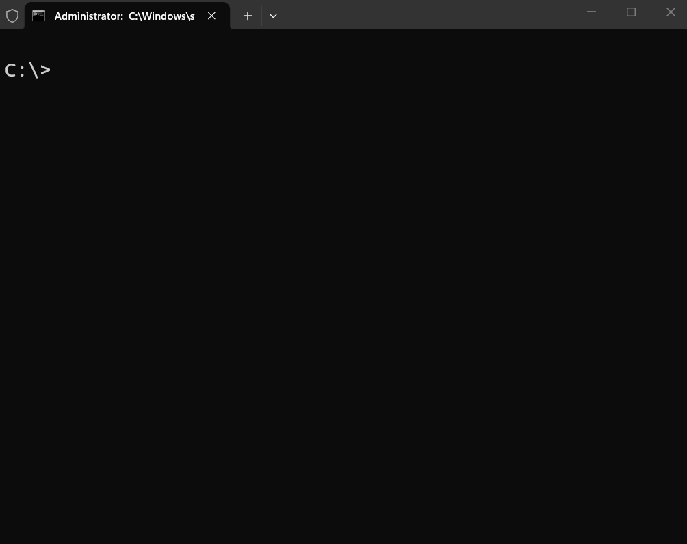

# portcontext

**Portable, user-owned AI context that carries across tools.**



Every AI tool — GitHub Copilot, Cursor, Claude, ChatGPT — keeps its own siloed
memory of who you are and how you work. There's no standard, user-owned "context
passport" you can carry *between* tools. `portcontext` is that missing layer:
you describe your preferences, project facts, and coding style **once**, keep it
in a plain file you own, and export it to whatever tool you're using today.

> Set up your context once. Take it everywhere.

---

## Why this doesn't exist yet

Tool vendors have no incentive to interoperate — your context is their lock-in.
`portcontext` is deliberately independent and open so the format stays
user-owned and portable. That's exactly the kind of project sponsorship keeps
alive.

## Install

```bash
npm install -g portcontext
```

Or run from source:

```bash
npm install
npm run build
node dist/cli.js --help
```

## Quick start

```bash
# 1. Create your context file (.portcontext/context.json)
portcontext init --owner "Jane Dev"

# 2. Add facts about how you work
portcontext add --section preferences --text "Prefer TypeScript, strict mode, no default exports"
portcontext add --section style --text "2-space indent, trailing commas" --tags formatting
portcontext add --section project --text "API base URL comes from API_BASE_URL env var"

# 3. See what you've captured
portcontext list

# 4. Export it to every AI tool at once
portcontext export --to all
#   -> AGENTS.md
#   -> .github/copilot-instructions.md
#   -> .cursor/rules/portcontext.mdc
#   -> CLAUDE.md

# ...or one tool at a time
portcontext export --to copilot
portcontext export --to json           # the canonical, portable format

# Already have an instructions file? Pull it in.
portcontext import --from AGENTS.md
```

## Concepts

- **Canonical file** — a single `context.json` you own and can commit, sync, or back up.
- **Sections** — `identity`, `preferences`, `project`, `style`, `other`.
- **Adapters** — render the canonical file into each tool's expected format.
  Ships with `markdown` (AGENTS.md), `copilot`, `cursor`, `claude`, and `json`.
  `export --to all` writes every tool's file to its conventional path in one command.
- **Import** — parse an existing `AGENTS.md`-style file back into your context so
  you can adopt portcontext without starting from scratch. Run `import` with no
  arguments to auto-detect Copilot/Cursor/Claude/AGENTS files in the current folder.
- **Sync** — back up and share your context across machines via any git remote
  (`portcontext sync setup --remote <url>`, then `push` / `pull`).
- **VS Code extension** — manage all of the above from the Command Palette. See
  [extension/](extension/).

## Roadmap

- [x] Adapters for Copilot, Cursor, and Claude
- [x] `import` from existing instruction files (with auto-detect)
- [x] Sync between machines (git-based)
- [x] VS Code extension ([extension/](extension/))
- [ ] Encrypted, opt-in sync
- [ ] Per-entry scoping (global vs. per-project)

## Programmatic use

```ts
import { loadContext, toMarkdown } from "portcontext";

const ctx = await loadContext();
console.log(toMarkdown(ctx));
```

## Sponsor this project

`portcontext` is built and maintained independently. If it saves you from
re-teaching every AI tool who you are, please consider sponsoring — it funds new
adapters, sync, and long-term maintenance. See [FUNDING](.github/FUNDING.yml).

## License

[MIT](LICENSE)
